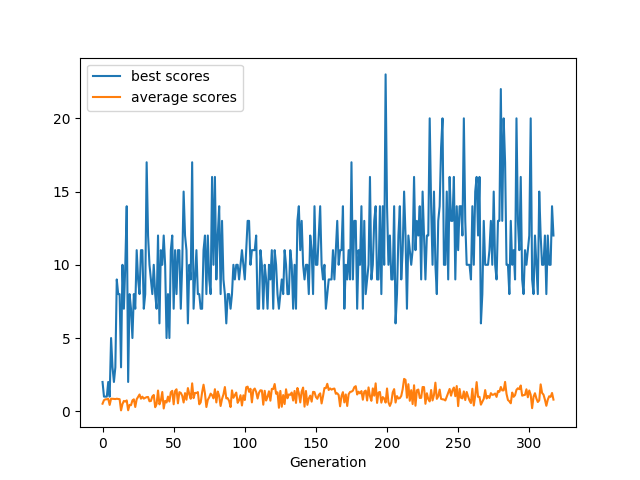

# NEAT-DontTouchTheSpikes
Neat implementation of the mobile game "Don't touch the spikes"

This project is an implementation of the mobile game "Don't touch the spikes" using the [NEAT algorithm.](https://neat-python.readthedocs.io/en/latest/)

The program can theorically train until it can play to infinity.
Realistically, I only trained it for a few hundred generations, allowing it to reach a maximum score of ~20.

As you can see in this plot depicting the evolution in best and average score for each generation, the evolution seems very good at first, but seems to not be able to reach an infinite score : the birds stop learning after a certain point (50-ish generations) and the average score stays the exact same.

Maybe I'm not doing the right thing, but I'm not sure. I might continue to tweak the program a little, but the fact that each generation can consistently reach a score of ~20 is a good sign and already a great achievement.